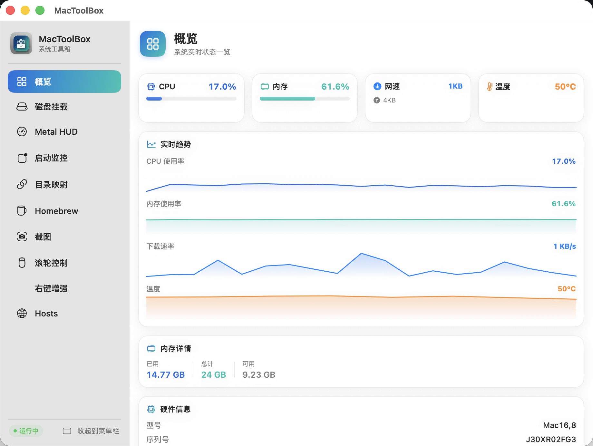

# MacToolBox

一款面向 Apple Silicon 的 macOS 系统工具箱，双形态运行：常驻菜单栏 + 独立主窗口。纯 SwiftUI + Swift 实现，**零第三方依赖**，全程 **Swift 严格并发**（`@MainActor` / `actor` / `Sendable` 约束）。

**视觉语言**：毛玻璃材质（NSVisualEffectView）+ 渐变强调色（蓝→青 #1E6FE0 → #17C3B2）+ 三段式菜单栏面板（渐变状态横幅 / 数据药丸 / 趋势画布）。



## 功能

底座由 11 个功能模块组成，每个都可在「功能开关」中独立启用 / 关闭（关闭后既不进侧边栏，也绝不实例化对应 Service，从源头省内存）。

| 功能 ID | 名称 | 图标 | 默认 | 说明 |
|---------|------|------|------|------|
| `overview` | 概览（常驻核心） | `square.grid.2x2` | 常驻 | CPU/内存/磁盘/电池/机型/开机时长/**CPU 温度** 聚合 Dashboard |
| `diskMount` | 磁盘挂载 | `externaldrive` | 开 | DiskArbitration 监听插盘，开机/插盘自动挂载指定卷 |
| `metalHUD` | Metal HUD | `speedometer` | 开 | `launchctl setenv METAL_HUD_ENABLED` 一键开关 GPU 调试 HUD |
| `appLaunch` | 启动监控 | `app.badge` | 开 | 实时显示每个应用启动的 PID/路径/参数 |
| `folderMap` | 目录映射 | `link` | 开 | 软链接管理（链接路径 ↔ 目标路径） |
| `brew` | Homebrew | `mug` | 开 | 已装/可清理/过期包查询 |
| `cleanup` | 垃圾清理 | `trash.fill` | 关 | 按 **系统 / 应用 / 上网** 垃圾分组，默认仅选安全项，分批清理（`actor` 隔离） |
| `launchAgent` | 启动项 | `power` | 关 | LaunchAgent/Daemon plist 解析与管理 |
| `screenshot` | 截图 | `camera.viewfinder` | 开 | 全屏 / 窗口 / **区域拖选** 截图，存文件 / 剪贴板，或**贴图**悬浮窗（拖动 / 缩放 / 关闭）；选区后工具条直接集成**就地标注**（矩形 / 圆形 / 箭头 / 画笔 / 文字 + 自定义取色 + 撤销） |
| `scrollControl` | 滚轮控制 | `computermouse` | 关 | 鼠标滚轮反向 + 平滑滚动，触控板豁免 |
| `rightClick` | 右键增强 | `hand.tap` | 关 | Finder 右键菜单（10 项）：新建文件 / 从模板新建 / 复制路径 / 复制文件名 / 用 App 打开 / 在终端打开 / 在 Finder 显示 / 直接删除 / 隐藏显示 / 常用目录。**免费路线：macOS Quick Action (.workflow)** + `mactoolbox://` URL 协议，零证书稳定出现在 Finder 右键「服务」子菜单 |
| `hosts` | Hosts | `globe` | 开 | SwitchHosts 类 hosts 管理：多方案增删改、一键切换 / 刷新系统 DNS、系统 hosts 实时预览，列表整行可点 |

核心能力：

- **截图**：基于 `CGDisplayCreateImage` 逐屏合成 + 无边框叠层遮罩，区域拖选 / 窗口吸附 / 全屏三模式；选区后**工具条直接集成标注工具，就地绘制**（矩形 / 圆形 / 箭头 / 画笔 / 文字 + 自定义取色器 + 撤销），再保存 / 复制 / 贴图，无需弹窗；支持**贴图悬浮窗**（拖动 / 滚轮缩放 / `Cmd+W`·`X`·`Esc` 关闭）。
- **滚轮控制**：基于 `CGEventTap` 的全局滚轮拦截引擎，支持反向 + 平滑滚动 + 触控板豁免。
- **右键增强**：Finder Sync 扩展注入右键菜单（10 项动作），瘦扩展模式：扩展只渲染菜单、操作在主进程执行；配置经 **App Group 共享文件**下发（Finder 重启也稳定），并保留分布式通知实时刷新。免费路线：`Info.plist` NSServices「服务」子菜单同享全部动作（免签名）。
- **全局快捷键**：基于 Carbon `RegisterEventHotKey`，零依赖、免辅助功能权限。支持区域截图 / 全屏截图 / 窗口截图 / 切换主窗口 / 打开概览，绑定可在「设置」中录制。
- **功能开关**：只启用需要的功能，主界面才出现对应入口；未启用功能的 Service 绝不实例化，降低常驻内存。
- **特权扩展点**：`PrivilegedOperations` 协议 + `UserSpacePrivilegedOperations` 普通权限实现，为未来特权 Helper（深层系统清理、受保护目录删除）预留干净接口。

## 技术栈

- **语言**: Swift 6 严格并发（`-swift-version 6`，`@MainActor` / `actor` / `Sendable` 全程约束）
- **UI**: SwiftUI（主面板）+ AppKit（NSStatusItem 菜单栏图标 + NSPopover + NSPanel 区域选）
- **系统 API**: DiskArbitration, IOKit, Mach (`host_statistics64`), sysctl, NSWorkspace, Carbon (RegisterEventHotKey)
- **构建**: 纯 `swiftc` + Command Line Tools，**不需要 Xcode**
- **依赖**: 零第三方依赖
- **图标**: 蓝青渐变工具箱主题图标（.icns + 菜单栏模板图标）

## 架构设计

重构后的代码严格分层，单一「功能真相来源」驱动整个 UI 与快捷键，**新增功能只需追加一条注册即可**。

```
MacToolBox/
├── build.sh                              # 构建脚本（swiftc + 手动 .app bundle，含 Carbon 链接）
├── test.sh                               # 沙盒测试（编译 Sources 排除 @main + Tests 为独立二进制）
├── run.sh                                # 启动脚本（open/build/rebuild/stop/status/clean）
├── Resources/
│   ├── Info.plist                        # LSUIElement=false（显示 Dock）
│   ├── AppIcon.icns / MenuBarIcon.png
│   └── IconMaster.png                    # 图标母版
├── Sources/
│   ├── MacToolBox/
│   │   ├── App/                          # 应用外壳层（@main 入口 + 委托 + 窗口/面板/设置）
│   │   │   ├── MacToolBoxApp.swift       # @main 入口（仅创建 AppDelegate）
│   │   │   ├── AppDelegate.swift         # NSApplicationDelegate；窗口/面板/快捷键生命周期
│   │   │   ├── MenuBarRootView.swift     # 主窗口根视图：侧边栏导航（由 FeatureManager 驱动）
│   │   │   ├── MenuBarPanelView.swift    # 菜单栏弹出面板（核心指标 + 快捷操作网格）
│   │   │   └── SettingsView.swift        # 设置：功能开关 + 全局快捷键录制 UI
│   │   ├── Core/                         # 核心层（与具体功能解耦的引擎）
│   │   │   ├── FeatureID.swift           # 功能枚举（CaseIterable 单一真相）
│   │   │   ├── FeatureManager.swift      # 功能注册表 + 启用解析 + 惰性实例化控制
│   │   │   ├── Hotkey.swift              # 快捷键模型（Carbon 掩码 / Codable / 显示串）
│   │   │   ├── HotkeyService.swift       # 全局快捷键服务（RegisterEventHotKey 注册/分发）
│   │   │   └── PrivilegedOperations.swift # 特权操作协议 + 普通权限实现（Helper 扩展点）
│   │   ├── Features/                     # 功能层（每个功能一个目录，含 Service + View）
│   │   │   ├── Overview/       OverviewView.swift
│   │   │   ├── DiskMount/      DiskMountService.swift  + DiskMountView.swift
│   │   │   ├── MetalHUD/       MetalHUDService.swift   + MetalHUDView.swift
│   │   │   ├── AppLaunch/      AppLaunchMonitorService.swift + AppLaunchMonitorView.swift + AppLaunchRecord.swift
│   │   │   ├── FolderMap/      FolderMapService.swift  + FolderMapView.swift
│   │   │   ├── Brew/           BrewService.swift       + BrewView.swift
│   │   │   ├── Cleanup/        DiskCleaner.swift(actor, CleanupTarget 路径地图) + CleanupService.swift + CleanupView.swift
│   │   │   ├── LaunchAgent/    LaunchAgentService.swift + LaunchAgentView.swift
│   │   │   ├── Screenshot/     ScreenshotCore.swift + CaptureOverlay.swift + PinManager.swift + WindowDetector.swift + ScreenshotView.swift
│   │   │   │   └── Annotation/ AnnotationCanvas.swift + AnnotationModels.swift + AnnotationToolbar.swift + AnnotationEditor.swift（就地标注）
│   │   │   ├── ScrollControl/  ScrollControlService.swift + ScrollEvent.swift + ScrollPoster.swift + ScrollControlView.swift
│   │   │   ├── Hosts/          HostsModels.swift + HostsService.swift + HostsView.swift + HostsTextView.swift（SwitchHosts 类）
│   │   │   └── RightClick/     RightClickService.swift  + RightClickModels.swift + RightClickActionHandlers.swift + RightClickView.swift
│   │   ├── Services/                     # 跨功能的共享服务
│   │   │   └── SystemInfoService.swift   # mach + sysctl + ioreg + SMC 温度（@Published 快照：平均 + 最热核心，后台读取）
│   │   ├── Shared/                      # 跨功能共享 UI
│   │   │   ├── Components.swift          # 主题/卡片/标签栏/进度条/格式化器
│   │   │   └── Sparkline.swift           # 迷你趋势图
│   │   └── Utilities/                   # 基础设施
│   │       ├── ConfigStore.swift         # JSON 持久化（config.json + 独立 features.json）
│   │       ├── Logger.swift              # OSLog
│   │       ├── ShellExecutor.swift       # Process 封装（Pipe 显式关闭）
│   │       ├── SMCReader.swift           # Apple Silicon SMC 温度读取（移植自 Stats）
│   │       └── IconCache.swift           # 图标缓存（AppIcon/MenuBarIcon 一次加载）
│   ├── FinderSyncExt/                   # Finder Sync 扩展（右键增强的独立进程）
│   │   ├── FinderSyncExt.swift          # FIFinderSync 子类：菜单渲染 + 点击转发
│   │   ├── Info.plist                   # NSExtension 声明
│   │   └── FinderSyncExt.entitlements   # 扩展 entitlements（沙盒 + App Group）
│   └── Shared/                          # 主程序与扩展共用的 IPC 层
│       └── RightClickShared.swift       # 消息类型 + RCMessager（DistributedNotificationCenter + SHA256 签名）
└── Tests/                                # 沙盒测试层（每个功能一个测试，纯逻辑可单测）
    ├── TestMain.swift                     # @main 测试入口（同步 + 异步 actor 汇总）
    ├── ScreenshotTests.swift             # CaptureMode / ScreenshotMath（区域裁剪 / 文件名 / 纯函数）
    ├── HotkeyTests.swift                  # Hotkey Codable / displayString / from(cocoa:)
    ├── BrewServiceTests.swift            # parseByteSize 字节解析
    ├── LaunchAgentServiceTests.swift      # parsePlistFile plist 解析
    ├── RightClickTests.swift             # 配置开关 / 签名校验 / RCMenuConfig 映射
    ├── ScrollEventTests.swift            # 滚轮事件解析 / 反向转换
    └── DiskCleanerTests.swift            # 扫描 / 删除 / 白名单越权保护（actor async）
```

### 分层职责

| 层 | 职责 | 关键约束 |
|----|------|----------|
| **App 外壳层** | 进程生命周期、窗口/面板、委托、设置入口 | `@main` 仅含入口；其余逻辑在 `AppDelegate` 便于测试排除 |
| **Core 核心层** | 功能注册表、快捷键、特权扩展点 —— 与具体 UI 解耦 | 单一「功能真相来源」驱动侧边栏/面板/快捷键 |
| **Features 功能层** | 每个功能的 Service（业务逻辑）+ View（UI） | Service 仅在功能被启用且用户切到该 Tab 时实例化（惰性）；清理功能内嵌分类规则引擎 |
| **Services 共享服务** | 跨功能的系统数据（系统信息、温度） | 发布者模式，UI 订阅不各自轮询 |
| **Shared / Utilities** | 共享 UI 组件、格式化、持久化、日志、Shell、SMC | `ConfigStore` 线程安全（`@unchecked Sendable` + barrier 队列） |

### 功能开关工作机制（省内存核心）

1. `FeatureID` 枚举列出全部功能，是唯一的「功能真相来源」。
2. `FeatureManager.buildDefinitions()` 注册每个功能的元数据 + `makeContent` 视图工厂。
3. 启动时对非核心功能做 `resolveEnabled`：若 `features.json` 已配置则按其存储；否则按 `defaultEnabled`。
4. **侧边栏、菜单栏面板、快捷键**全部由 `FeatureManager.enabledDefinitions` 驱动 —— 未启用功能既不在 UI 出现，其 `makeContent()` 也绝不被调用，故对应 Service 不会被实例化。
5. 用户在「设置 → 功能开关」切换后，`setEnabled` 立即持久化到 `features.json`；核心功能（概览）不可关闭。

### UI 设计语言

macOS 原生质感 + 蓝青渐变品牌色：

| 层级 | 组件 | 实现方式 |
|------|------|----------|
| **窗口材质** | 主窗口背景 | `VisualEffectView(.windowBackground, .behindWindow)` 透出桌面磨砂玻璃 |
| **侧栏** | 导航栏 | `VisualEffectView(.sidebar)` 层叠质感 |
| **气泡** | 菜单栏面板 | `VisualEffectView(.popover)` + 三段式布局 |
| **状态横幅** | 气泡顶部 | 渐变底（正常蓝→青/负载橙→红）+ 白字图标光晕 |
| **数据药丸** | 气泡指标卡 | 左 3px 色条 + 圆形图标底色圈 + 大号数字 |
| **趋势画布** | 气泡图表区 | 微渐变底 + 图标标题行 + 右侧实时值 |
| **卡片** | 主窗口内容 | 圆角 14 + 顶部高光 + 柔和外阴影 |
| **页头** | 每个功能页顶栏 | 渐变图标徽章 + 粗体标题(19pt) + 副标题 |
| **过渡** | Tab 切换 | `.transition(.opacity)` 0.22s 淡入 |
| **数字** | 所有指标值 | `.contentTransition(.numericText())` 平滑跳变 |
| **悬停** | 按钮/药丸 | `.onHover` 微提亮反馈 |

### 全局快捷键

- `Hotkey.swift`：模型化快捷键（keyCode + Carbon 修饰符掩码），`Codable` 持久化，`displayString` 显示。
- `HotkeyService.swift`：`RegisterEventHotKey` 注册全部绑定；按键事件经 `InstallEventHandler` 派发到主线程 `fire(_:)`。
- 支持动作：`regionScreenshot` / `fullScreenshot` / `windowScreenshot` / `toggleMainWindow` / `openOverview`，各有默认绑定，可在设置中重新录制。
- 无需辅助功能权限（Carbon 全局热键走系统事件，区别于 Accessibility API）。

### 特权扩展点

`Core/PrivilegedOperations.swift` 定义协议 `PrivilegedOperations`（`removeItem` / `moveItem`，带越权保护），当前由 `UserSpacePrivilegedOperations`（仅用户可写区域）实现。未来接入特权 Helper（SMJobBless / LaunchDaemon）时，只需提供一个遵守该协议、内部走 XPC 的实现，**上层调用方代码零改动**。

## 快速开始

```bash
# 第一次运行（编译 + 启动）
./run.sh open

# 其他命令
./run.sh build       # 仅编译
./run.sh rebuild     # 重新编译并启动
./run.sh stop        # 关闭 App
./run.sh status      # 查看是否在运行
./run.sh clean       # 清理 build 目录

# 运行沙盒测试（编译 Sources 排除 @main + Tests，独立二进制运行）
./test.sh
```

启动后会在屏幕顶部菜单栏看到一个工具箱图标，点击展开核心指标面板；同时 Dock 上也会出现应用图标，点击可打开侧边栏主窗口。配置入口在「设置」（菜单栏右键「设置…」或快捷键），可开关功能、录制快捷键。

## 双形态运行

- **菜单栏**: 点击工具箱图标弹出 popover（紧凑面板），展示核心指标 + 快捷操作网格（仅已启用功能）。
- **主窗口**: 标准 NSWindow，左侧图标侧边栏导航（由 FeatureManager 驱动，仅已启用功能）。关闭后 App 仍常驻。
- **设置**: 功能开关（逐项启用/关闭）+ 全局快捷键（录制绑定）。
- **Dock 图标**: 点击 Dock 图标可重新打开主窗口（落到概览或上次功能）。
- **退出**: 菜单栏右键「退出 MacToolBox」或 Cmd+Q。

## 内存占用

| 指标 | 数值 |
|------|------|
| 二进制大小 | ~800 KB |
| .app bundle | ~3.9 MB（含图标） |
| 运行时内存（RSS） | 130-145 MB |
| 启动时间 | < 1 秒 |

### 内存与性能优化措施

- **功能开关驱动惰性实例化**：未启用功能的 Service 绝不创建（不在侧边栏、不进 `makeContent()`）。
- **延迟启动后台服务**：`DiskMountService`、`AppLaunchMonitorService`、`BrewService` 仅在首次进入对应 Tab（`onAppear`）时才初始化。
- **消除冗余 Timer**：菜单栏标题订阅 `SystemInfoService.$snapshot` 发布者；面板/设置预览依赖 SwiftUI 状态，删除独立轮询 Timer。
- **温度读取移出主线程 + 合并监控**：原 `TemperatureMonitor` 孤儿 1Hz 轮询已合并进 `SystemInfoService`；SMC 内核调用（含 `usleep` 重试）在专属串行队列执行，彻底消除主线程阻塞。快照一次性提供「平均 + 最热核心」温度，避免重复读取。
- **主线程阻塞消除**：应用启动监控的 `ps` 取参、Metal HUD 的 `setsid` 启动拉起、文件夹映射 `init` 的磁盘 I/O 全部移到后台队列，主线程零等待。
- **子进程开销削减**：磁盘列表改为一次 `diskutil list -plist` 枚举所有卷后再逐个取详情（跳过物理盘 / 容器 / 系统卷）；Homebrew 动作后的局部刷新跳过耗时的 `brew cleanup -n --prune=all` 干跑，复用上次估算值。
- **重复分配与重渲染消除**：`Sparkline` 每帧只计算一次几何点（面积与折线共用）；截图缩略图在创建时解码一次并缓存，不再每次渲染从磁盘重新解码；`ByteCountFormatter` / `DateFormatter` 统一为静态共享实例；快捷键变更只重渲染快捷键卡片而非整页。
- **温度读取降频**：SMC 内核调用 5s 一次（EMA 平滑），主轮询 2s 处理 CPU/内存/网络；**磁盘枚举降频至 20s**（其余轮询复用缓存）。
- **图标缓存**：AppIcon / MenuBarIcon 通过 `IconCache` 一次加载，避免 SwiftUI 每帧 `NSImage(contentsOfFile:)` 重复读盘。
- **reveal 跳转零重建**：侧栏选中状态由 `FeatureManager.selectedFeature`（共享 Binding）驱动，从菜单栏面板跳转特定功能页时仅设值+显示窗口，不再重建整棵视图树（修复了「跳转总落到概览」的 bug + 消除内存抖动）。
- **启动非阻塞**：NSServices 注册的 `lsregister` 进程调用移到后台队列；主线程启动零阻塞。
- **Pipe 资源释放**：ShellExecutor 显式关闭 stdout/stderr Pipe 文件句柄。

参考对比：Chrome 单标签页 100-200MB，VSCode 1GB+。

## 工作原理

### 菜单栏图标

经典 `NSStatusBar.statusItem` + `NSPopover` + `NSHostingController` 组合，加载自定义模板图标。点击展开面板；完整功能从面板或 Dock 打开主窗口。

### 垃圾清理

对标开源 [Clean-Me](https://github.com/Kevin-De-Koninck/Clean-Me)（Swift，1.8k★）重构：

- **清理路径地图**：`DiskCleaner` 定义 `CleanupTarget` 覆盖多类位置——用户 / 系统缓存、用户 / 系统日志、临时目录、`Xcode DerivedData`、废纸篓等（原实现仅覆盖 3 处）。
- **分类规则引擎**：按路径识别每条垃圾类别（系统垃圾 / 应用缓存 / 上网缓存 / 开发工具缓存等），并增强识别 Xcode 派生数据、iOS 模拟器、`npm` / `Homebrew` / `Go` / `Cargo` / `Clang` 等开发工具缓存。
- **按来源聚合 UI**：扫描结束按「来源文件夹」聚合为 `SourceSection`，每来源下再按应用分组（`AppGroup`）；基础（用户级）/ 系统级分离，系统级标锁并提示「需管理员」。界面以来源卡片展示，可折叠 / 展开。
- **安全模型（核心）**：沿用 Clean-Me「**只删内容不删根目录**」原则——删除时绝不触碰根目录本身（`isRoot` 保护），误点「全选」也不会删除系统目录。
- **默认安全选中**：仅自动勾选 `risk == .safe` 且非系统级的项；系统级（需管理员）默认不选，避免选中后删不掉。
- **分批清理**：`CleanupService.clean` 把选中项按 `chunkSize = 50` 分批次交给 `DiskCleaner.delete`，每批之间 `Task.yield()` 让出事件循环，避免阻塞 UI。
- **白名单保护**：任何不在 `allowedRoots` 前缀下的路径都不扫描、不删除。

### 磁盘自动挂载

`DiskArbitration.framework` 的 `DARegisterDiskAppearedCallback` 监听磁盘物理插入；`diskutil mount` 完成挂载。配置持久化在 `Application Support/MacToolBox/config.json`。

### Metal HUD 开关

```bash
launchctl setenv METAL_HUD_ENABLED 1     # 开启
launchctl unsetenv METAL_HUD_ENABLED     # 关闭
```

> 仅对新启动的应用生效，已运行的应用需重启。

### 应用启动监控

`NSWorkspace.didLaunchApplicationNotification` 接收启动事件；`ps eww -p <pid>` 读取参数。非 root 进程读取其他进程环境变量可能受限（macOS SIP）。

### 启动项

对标开源 [KnockKnock](https://github.com/objective-see/KnockKnock)（Objective-See，持久化枚举器）重构，枚举多个持久化位置而非单一目录：

- **多位置枚举**：用户 LaunchAgents（`~/Library/LaunchAgents`）、系统 LaunchAgents（`/Library/LaunchAgents`）、系统 LaunchDaemons（`/Library/LaunchDaemons`）、`/System/Library` 只读 Agents/Daemons。
- **类型与作用域**：每项带 `kind`（`agent` / `daemon`）与 `scope`（`user` / `system` / `systemReadOnly`），区分可管理性。
- **用户级可管理**：备份后禁用 / 恢复（保留原安全机制，不直接物理删除）；Finder 中定位。
- **系统级**：App 内不可改（需 root），提供一键复制 `launchctl` 命令（系统级自动加 `sudo`）；系统只读项仅展示并标锁。
- 本 App 普通权限运行，系统级目录需 root 才能改，故系统级项以「查看 + 复制命令」为主，与 KnockKnock「发现为主」定位一致。

### 截图

对标开源 [capcap](https://github.com/realskyrin/capcap)（纯 AppKit 零依赖）重构，三模式：

- **全屏**：直接截取光标所在屏并保存到默认位置（或 `pin` 直接贴图）。
- **区域拖选**：逐屏 `CGDisplayCreateImage` 合成快照，铺无边框 `OverlayWindow`（borderless + `.screenSaver` 级别）整屏暗化遮罩；`SelectionView` 拖拽选区，进入即整屏蒙版提示，悬停窗口挖洞高亮（窗口吸附）。
- **窗口**：`CGWindowListCopyWindowInfo` 枚举窗口，`WindowDetector` 吸附，单击即捕。
- **选区工具条**：选中后浮动工具条直接集成标注工具（矩形 / 圆形 / 箭头 / 画笔 / 文字）+ 自定义取色器（点击弹系统色板）+ 撤销，在选区上**就地绘制**；右侧操作按钮：保存 / 复制 / 贴图 / 取消。双击 / 回车 = 保存，`Cmd+Z` = 撤销标注，Esc / 右键取消；`CaptureSession` 加 `isCapturing` 守卫防重复触发快捷键。
- **贴图**：`PinManager` 把选区裁图贴为浮动窗，按**屏幕原始比例**展示（Retina 下按 `backingScaleFactor` 换算逻辑点，不再 2× 放大），支持拖动（按绝对位置差，四向正确）、滚轮缩放、`Cmd+W` / `X` / `Esc` 关闭、多张叠加。
- 纯函数 `ScreenshotMath.clamp` / `ScreenshotFlow.buildFilename` / `savePNG` 可独立单测。

### 全局快捷键

Carbon `RegisterEventHotKey` 在 `HotkeyService` 内注册；系统按键事件经 `InstallEventHandler` 捕获并 `DispatchQueue.main.async` 派发到对应动作（截图 / 切换窗口 / 打开概览）。绑定持久化在 `features.json`。

### CPU 温度读取（Apple Silicon）

来自 Apple SMC，实现见 `Utilities/SMCReader.swift`：

- **无需特权**：Apple Silicon 普通用户进程即可经 `AppleSMC` 读取温度键（移植自 [Stats](https://github.com/exelban/stats) 的 `SMC/smc.swift`，精确 `SMCKeyData_t` 布局 + selector=2 两步读协议）。
- **多核心平均**：取一组核心 die 温度传感器（`Tp*/Tc*/Te*/Tg*`）有效读数求平均，过滤电源门控占位假值（idle 时某些核心读出 ~5°C）。
- **最热核心 + 平均**：`SystemInfoService.snapshot` 同时提供 `temperature`（多核心平均，EMA 平滑）与 `temperatureHottest`（最热核心），概览页一并展示；温度读取在后台串行队列完成，**不阻塞主线程**。
- **时间平滑**：`SystemInfoService` 内 EMA（系数 0.3）抹平抖动；读不到时保留上一帧，UI 不闪「—」。
- 详细原理见 **[docs/Temperature-SMC.md](docs/Temperature-SMC.md)**、**[docs/RightClick-Architecture.md](docs/RightClick-Architecture.md)**、**[docs/ScrollControl-Architecture.md](docs/ScrollControl-Architecture.md)**。

## 系统要求

- **最低 macOS**: 13.0 (Ventura)
- **架构**: Apple Silicon (arm64)
- **构建工具**: Command Line Tools 即可，不需要 Xcode
- **权限**: 不需要辅助功能权限（全局快捷键走 Carbon 热键，非 Accessibility）
  - 磁盘挂载需要管理员授权（首次弹窗）
  - 读取其他进程环境变量可能受 SIP 部分限制
  - CPU 温度读取为普通用户态 SMC 访问，无需 root / 特权 helper

## 沙盒测试

`test.sh` 把 `Sources`（排除含 `@main` 的 `MacToolBoxApp.swift`，避免与测试入口冲突）与 `Tests/` 一起编译为独立二进制 `build/test/test_runner` 并运行。每个功能模块都有对应纯逻辑 / 沙盒测试：

| 测试 | 覆盖 |
|------|------|
| `ScreenshotTests` | `CaptureMode` / `ScreenshotMath`（区域裁剪 / 文件名 / 纯函数） |
| `HotkeyTests` | `Hotkey` Codable 往返、显示串 `displayString`、`from(cocoa:)` 掩码转换 |
| `BrewServiceTests` | 字节大小 `parseByteSize` 解析 |
| `LaunchAgentServiceTests` | `parsePlistFile` plist 解析（启用/禁用项） |
| `RightClickTests` | 配置开关 / 签名校验 / `RCMenuConfig` 映射 |
| `ScrollEventTests` | 滚轮事件解析 / 反向转换 |
| `DiskCleanerTests` |（`actor` async）扫描 / 删除 / 白名单越权保护 / 路径地图 / **默认选择** / **分批清理** |

测试不依赖真实 UI 或特权：纯函数直接断言；`DiskCleaner` 经 `init(allowedRoots:)` 注入沙盒目录，删除越权路径被安全拒绝。全部通过时输出 `✅ ALL TESTS PASSED`。

## 已知限制

1. **没有签名**: 首次运行需在「系统设置 → 隐私与安全」中允许。
2. **没有自动更新**: 需手动 `./run.sh rebuild`。
3. **状态保存**: 挂载规则、Metal HUD、菜单栏配置、功能开关、快捷键绑定均持久化；其余为临时数据。
4. **主窗口位置**: 默认居中，多显示器下可能出现在上次关闭的显示器。
5. **特权 Helper**: 当前为普通权限实现，深层系统清理 / 受保护目录删除的 Helper 骨架尚未实装（已预留 `PrivilegedOperations` 接口）。

## 后续计划

- Apple Developer 签名 + Notarize（解决右键扩展/Quick Action 签名限制）
- Sparkle 自动更新
- 特权 Helper 骨架（SMJobBless / LaunchDaemon + XPC），接入 `PrivilegedOperations`
- 清理筛选规则增强（按类型/年龄/体积）
- 深色模式微调（强调色在暗壁纸上适配）
- 菜单栏图标随 CPU/温度变色（小生命感）

## License

本项目基于 [MIT License](LICENSE) 开源。详见 [LICENSE](LICENSE)。
